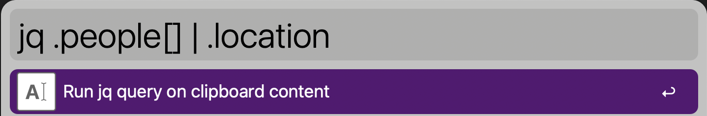
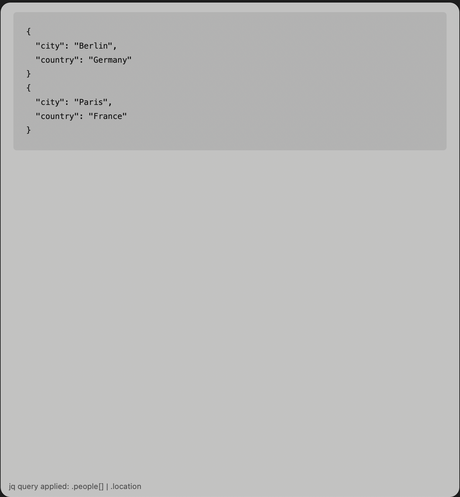

# Alfred Workflow: JQ JSON Parser

## Overview

The **JQ JSON Parser** Alfred Workflow allows you to quickly apply jq queries to JSON data stored in your clipboard. It simplifies parsing, filtering, and analyzing JSON data directly in Alfred.

## Installation

1. **Download the workflow** from the [Release Page](https://github.com/tihmels/alfred-workflow-jq/releases/tag/0.0.1).
2. Import the workflow into Alfred.
3. Follow the setup instructions below to configure dependencies.

## Requirements

1. **Alfred**: Requires Alfred (with Powerpack).
2. **jq**: Install via Homebrew:

   ```bash
   brew install jq
   ```
3. **Python Virtual Environment**:
   - Create the virtual environment **in the workflow folder**:

     ```bash
     cd /path/to/your/alfred/workflow/folder
     python3 -m venv venv
     ```
   - Activate the virtual environment:

     ```bash
     source venv/bin/activate
     ```
   - Install dependencies:
   
     ```bash
     pip install -r requirements.txt
     ```

## Usage

1. **Copy JSON to Clipboard**: Copy valid JSON data to your clipboard.
2. **Run Workflow**:
   - Open Alfred, type `jq` followed by your query.
   - Example queries:
     - `jq .key`
     - `jq map(select(.age > 30))`
     - `jq .[] | .name`
   - Leave blank to view the full JSON.
3. **View Results**: Output will appear in a formatted Text View.

## Example

### Clipboard JSON:
```json
{
    "people": [
        {
            "name": "Alice",
            "age": 30,
            "location": {
                "city": "Berlin",
                "country": "Germany"
            },
            "skills": ["Python", "JavaScript"]
        },
        {
            "name": "Bob",
            "age": 25,
            "location": {
                "city": "Paris",
                "country": "France"
            },
            "skills": ["Java", "C++"]
        }
    ]
}
```

### Query: Extract Locations


**Output**:

